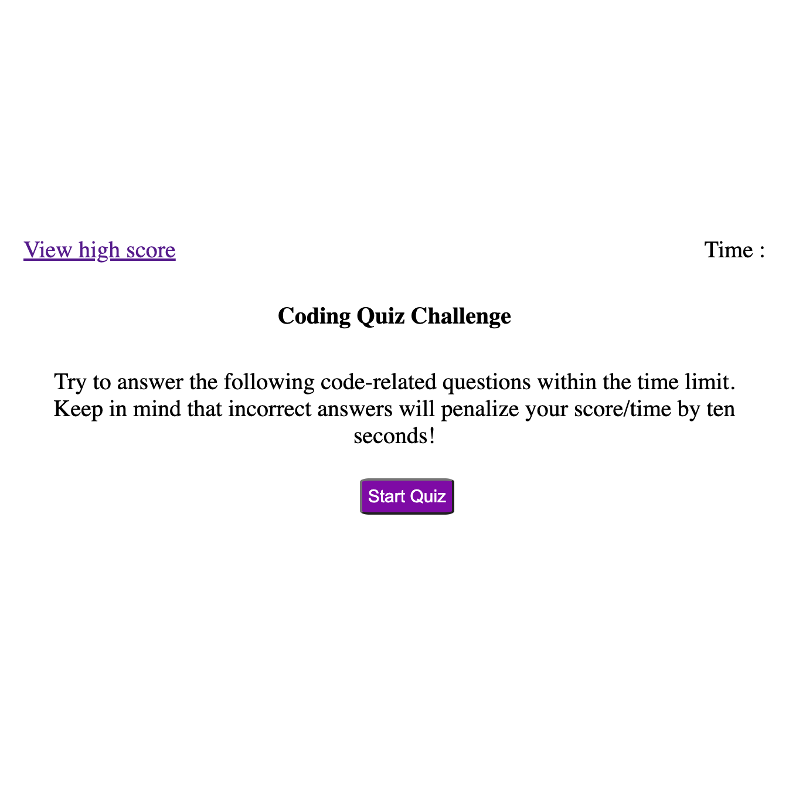

# codeQuiz

Build a timed quiz with multiple-choice questions. This app will run in the browser and will feature dynamically updated HTML and CSS powered by Javascript code.

## Description

This App will ask 5 questions with 4 options of answers. The time is given for 75s and score is equal to the time left.
When you answer incorrectly, time is subtracted 10s from the clock.
When you finish all questions, you are presented with a score and you can save your initial and score.
You can gauge your progress compared to my peers.

## Acceptance Criteria

* It is done When I am taking a code quiz by clicking the start button.
* It is done when a timer starts(75s) and I am presented with a question.
* When I answer a question, I am presented with another question.
* When I answer a question incorrectly, time is subtracted 10s from the clock.
* If All questions are answered or the timer reaches 0, the game is over.
* When the game is over, the score is displayed and I can save my initials and my score to the local storage.
* The score is equal to an amount of time left.
* You can delete the stored date by clicking "clear high score" button.
* You can see the list of high scores anytime. When you hit "View high Score" during the quiz, the quiz will end.

## Mock-Up

First page of Quiz. you can start the quiz by clicking start button or you can see previous high score by clicking "view high score".

When you click start button, the Quiz starts and display questions. A timer starts once you starts the quiz.
.png)
When you finished all questions, you can save your initial and score.
.png)
Your score is saved to local storage and displayed.
.png)

## Deployed github
https://rogseo.github.io/codeQuiz/
